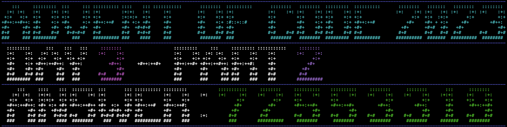

# Advent of Code 2023 Solutions



This repository contains my solutions for the [Advent of Code 2023](https://adventofcode.com/2023) event. Each day's puzzle is solved with a separate Rust module.

## Structure

The solutions for each day are located in their respective directories under the `src` directory. Each directory is named `day_x` where `x` is the string representation of the day number (e.g., `day_one` for Day 1).

Each `day_x` directory contains the following files:

-   `part_one.rs`: Contains the solution for Part 1 of the day's puzzle.
-   `part_two.rs`: Contains the solution for Part 2 of the day's puzzle.
-   `input.txt`: Contains the puzzle input.

## Usage

To run a solution, navigate to the root directory of the project and run the following command:

```bash
cargo run -- <day_x> <part_x>
# eg. `cargo run -- 3 2` to run the solution for day 3 part 2
```
